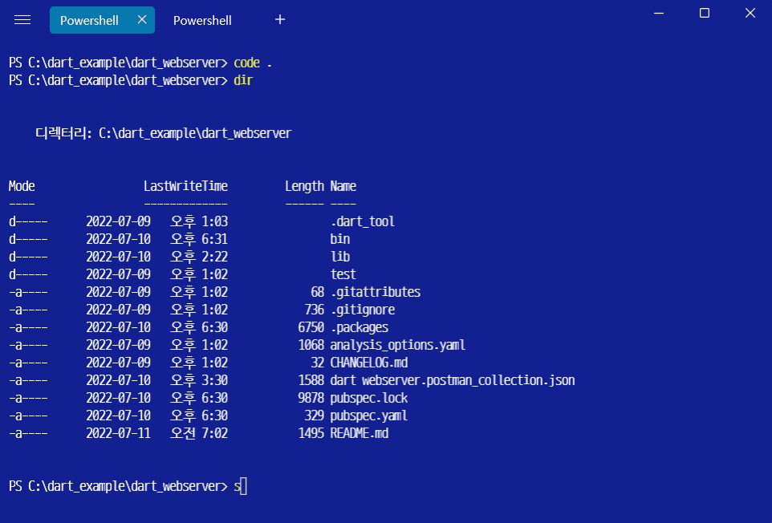

# dart_webserver

> dart로 앱/웹 개발 테스트용 서버만들기

dart web plugin : shelf

- https://pub.dev/packages/shelf
- https://pub.dev/documentation/shelf/latest/

참고사이트:

- https://oldmetalmind.medium.com/dart-shelf-backend-with-dart-f068d4f37a7a
- https://dev.to/alexmercedcoder/creating-apis-with-dart-google-43hf

참고유튜브:

- https://www.youtube.com/watch?v=v7FhaV9e3yY&t=935s
- https://www.youtube.com/watch?v=Y5X5rdzFScs&list=PL3UwowPBo8XEDvDDY7fpurOLt7hhYMBlx

dio 참고
- https://pub.dev/packages/dio#examples

----

> dart 웹서버를 서비스용으로 고려하지 않는다.

이유는 
- 참고할 레퍼런스가 없다.
- 다른 좋은 서버 플랫폼은 넘친다.

이다. 
그럼에도 불구하고 dart로 웹서버를 만드는 이유는 다음과 같다.

- 앱 개발시, 서버가 만들어지지 않은 시점에서 테스트용 서버로 사용가능
- 같은 Dart 언어를 사용함으로 소스차원(패킷, 프로토콜)의 호환성이 좋음
- 같은 개발환경이므로 서버와 앱을 번걸아가며 빌드해도 부담없음

이렇게 앱 개발시에 앱개발자가 웹서버까지 만들필요가 있을 경우는 

#### 앱개발시 서버담당자의 개발상태와 무관하게 서버모듈을 붙여 구현하고자 할 때.

이다.

----

> dart 웹서버를 구현하기 위해서 shelf를 사용한다. 그리고 클라이언트 테스트를 위해 dio를 사용한다.

plugin 설치
~~~

dart pub add shelf
dart pub add shelf_router
dart pub add dio

~~~

----

> test

----

> json 직렬화방법

dart에서는 json 직렬화하는 방법이 크게 2가지가 있다. 하나는 제너레이션 툴을 사용하는 방법이고 나머지는 툴을 사용하지 않는 방법이다. jsonDecode(), jsonEncode()를 사용하여 직렬화를 사용한다면
선언하는 클래스에서 각 함수에서 필요로 하는 메소드를 구현해주어야 한다.

~~~dart
// 로그인
class ReqLoginPacket{
  String user;
  String passwd;
  
  ReqLoginPacket(this.user, this.passwd);

  // jsondecode()를 사용할 경우, 반드시 필요한 Function
  // 이것이 없으면 캐스팅 에러가 발생함
  ReqLoginPacket.fromJson(Map<String, dynamic> json)
      : user = json['user'],
        passwd = json['passwd'];

  // jsonencode()를 사용할 경우, 반드시 필요한 Function
  Map toJson() => {
        'user': user,
        'passwd': passwd
  };      
}

~~~

dart 공식페이지 

- https://flutter-ko.dev/docs/development/data-and-backend/json

----

> shelf 플러그인 빠르게 훑어보기

대부분의 서버 프래임웍에서 사용하는 필수기능만 제공한다. 메인서버로 개발하기에는 자료가 빈약한 편이다. serve() 함수를 실행하며 넘겨지는 Handler 객체를 통해 router(router 플러그인 설치)와 Url요청, 파라메터 처리를 한다.

~~~dart

import 'package:shelf/shelf.dart';
import 'package:shelf/shelf_io.dart' as shelf_server;
import 'service.dart';

void runServer() async {
  final service = Service();
  final server = await shelf_server.serve(service.handler, '127.0.0.1', 8080);

  print('server running : http://${server.address.host}:${server.port}');
}

~~~

[service.dart]
~~~dart
import 'dart:convert';

import 'package:shelf/shelf.dart';
import 'package:shelf_router/shelf_router.dart';
import 'package:webserver/RequestData.dart';
import 'package:webserver/ResponseData.dart';
import 'login_api.dart';

class Service {
  Handler get handler {
    final router = Router();

    
    // GET :
    router.get('/', (Request request) async {
      await Future.delayed(Duration(milliseconds: 400));
      
      var b = resultPacket("success","this site for only mobile API." , "");
      return Response.ok(jsonEncode(b));
    });

    // GET : 경로명 처리
    router.get('/<req>', (Request request, String req) {
      var b = resultPacket("fail","your request $req not allowed." , "");
      return Response.ok(jsonEncode(b));
    });

    // 주의: 'router.all' 이전에 처리해야 함.
    // mount()는 주로 요청을 목적별(login, 화면, ..) 분류하기 위해 사용됨
    router.mount('/loginapi/', loginApi().router);

    // 요청을 찾지 못했을 경우
    router.all('/<ignored|.*>', (Request request) {
      var b = resultPacket("fail","request not found." , "");
      return Response.notFound(jsonEncode(b));
    });

    return router;
  }
}

[login_api.dart]
~~~dart
import 'dart:convert';

import 'package:shelf/shelf.dart';
import 'package:webserver/RequestData.dart';
import 'package:webserver/ResponseData.dart';
import 'package:webserver/datamanager.dart';

import 'package:shelf_router/shelf_router.dart';

class loginApi {

  Router get router {
    final router = Router();

    router.post('/reg/', (Request request) async {
      final payload = await request.readAsString();
      
      try{
        
        // 요청분석
        var p = jsonDecode(payload);
        var d = ReqRegisterPacket.fromJson(p);
        
        // 실패했을 경우, 응답.
        var res = jsonEncode(resultPacket("success", "user is not registed(already registed).", "{}"));

        if (!DB.isExistData(d.user)){
          // 사용자 추가 
          var newItem = DataLogin(d.user, d.passwd, d.level);
          DB.add(newItem);

          // 응답처리 (data에 json 정보전달)
          res = jsonEncode(resultPacket("success", "ok", "${jsonEncode(newItem)}"));
          return Response.ok(res);
        }  

        return Response.ok(res);
      
      } catch(e){
        return Response.ok('$e');
      }
      
    });

    router.post('/login/', (Request request) async {
      final payload = await request.readAsString();
      
      try{
        // 요청분석
        var p = jsonDecode(payload);
        var d = ReqLoginPacket.fromJson(p);
        
        // 실패했을 경우, 응답.
        var res = jsonEncode(resultPacket("success", "user is not found.", "{}"));

        if (DB.isExistData(d.user)){
          
          // 응답처리
          if (DB.isPasswdOkByUser(d.user, d.passwd)){
            res = jsonEncode(resultPacket("success", "login ok", "{}"));
            return Response.ok(res); 
          }

        }  
        return Response.ok(res);
      
      } catch(e){
        return Response.ok('$e');
      }
      
    });
    
    router.all('/<ignored|.*>', (Request request) => Response.notFound('null'));
    return router;
  }
}
~~~

[datamanager.dart]

~~~dart

import 'package:webserver/ResponseData.dart';

class SimpleDBManager{
  var db = <DataLogin>[];
  
  void add (DataLogin d) => db.add(d);

  bool isExistData (String user){
    var b = db.firstWhere((d) => d.user == user, orElse: () => DataLogin("", "", 0));
    return b.user != "";
  }

  bool isPasswdOkByUser (String user, String passwd){
    var b = db.firstWhere((d) => d.user == user, orElse: () => DataLogin("", "",  0));
    return b.passwd == passwd;
  }
}
  
var DB = SimpleDBManager();

~~~

----

> dio를 이용한 테스트 클라이언트

json 직렬화를 통해 테스트를 한다.

[webclient_test.dart]
~~~dart
import 'dart:convert';
import 'dart:io';

import 'package:dio/dio.dart';
import 'package:webserver/RequestData.dart';
import 'package:webserver/ResponseData.dart';

Future<void> main(List<String> arguments) async {
  testRegisterUser();
  testLoginUser();
}

var host = "http://127.0.0.1:8080";

void testLoginUser() async {
  try {
    var req = jsonEncode(ReqLoginPacket("user1", "1234"));

    var dio = Dio();
    Response response = await dio.post("${host}/loginapi/login/",
        data: req,
        options: Options(headers: {
          HttpHeaders.contentTypeHeader: "application/json",
        }));

    if (response.statusCode != 200) return;

    var res = resultPacket.fromJson(jsonDecode(response.toString()));
    print("result => ${res.result} msg => ${res.msg} data => ${res.data} ");
  } catch (error, stackTrace) {
    print("Exception occurred: $error  stackTrace: $stackTrace");
    return;
  }
}

void testRegisterUser() async {
  try {
    var req = jsonEncode(ReqRegisterPacket("user1", "1234", 10));

    var dio = Dio();
    Response response = await dio.post("${host}/loginapi/reg/",
        data: req,
        options: Options(headers: {
          HttpHeaders.contentTypeHeader: "application/json",
        }));

    if (response.statusCode != 200) return;

    var res = resultPacket.fromJson(jsonDecode(response.toString()));
    print("result => ${res.result} msg => ${res.msg} data => ${res.data} ");
    if (res.data != "{}") {
      var res2 = ReqRegisterPacket.fromJson(jsonDecode(res.data));
      print("user => ${res2.user}");
    }
  } catch (error, stackTrace) {
    print("Exception occurred: $error  stackTrace: $stackTrace");
    return;
  }
}

~~~

